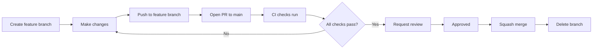

# Engineering Workflow Standard v1.0

> **Balancing Rock** - Universal Engineering Standards

## Overview

This document defines the standard engineering workflow for all projects. It ensures consistent, secure, and efficient development practices for solo developers working with AI agents.

## Table of Contents

1. [Branch Strategy](#branch-strategy)
2. [Development Workflow](#development-workflow)
3. [Code Review Process](#code-review-process)
4. [CI/CD Pipeline](#cicd-pipeline)
5. [Release Process](#release-process)
6. [Security Requirements](#security-requirements)

---

## Branch Strategy

### Permanent Branches

| Branch | Purpose | Protection Level |
|--------|---------|------------------|
| `main` | Production-ready code, always deployable | **Maximum** |

### Temporary Branches

| Pattern | Purpose | Lifetime |
|---------|---------|----------|
| `feature/<task>` | New features and improvements | Until merged |
| `hotfix/<issue>` | Emergency production fixes | Until merged |

### Branch Naming Convention

```
feature/add-user-authentication
feature/update-dashboard-ui
hotfix/fix-login-crash
hotfix/patch-security-vulnerability
```

---

## Development Workflow

### For All Contributors (Humans and AI Agents)



### Step-by-Step Process

1. **Create Feature Branch**
   ```bash
   git checkout main
   git pull origin main
   git checkout -b feature/your-task-name
   ```

2. **Make Changes**
   - Write code
   - Write/update tests
   - Update documentation

3. **Commit Changes**
   ```bash
   git add .
   git commit -m "feat: add user authentication"
   ```

4. **Push and Open PR**
   ```bash
   git push origin feature/your-task-name
   # Open PR via GitHub UI
   ```

5. **Wait for CI**
   - All automated checks must pass
   - Security scans must be clean

6. **Get Review**
   - CODEOWNERS automatically assigned
   - Address all comments

7. **Merge**
   - Squash merge to main
   - Delete feature branch

---

## Code Review Process

### Requirements for All PRs

- [ ] All CI checks passing
- [ ] No security vulnerabilities
- [ ] No secrets in code
- [ ] Tests included for new functionality
- [ ] Documentation updated
- [ ] At least one approval from CODEOWNERS

### Review Checklist

**Code Quality**
- [ ] Code follows project style guide
- [ ] No unnecessary complexity
- [ ] Proper error handling
- [ ] No hardcoded values that should be configurable

**Security**
- [ ] No sensitive data exposed
- [ ] Input validation present
- [ ] Authentication/authorization correct
- [ ] Dependencies are secure

**Testing**
- [ ] Unit tests cover new code
- [ ] Edge cases handled
- [ ] Tests are meaningful (not just for coverage)

---

## CI/CD Pipeline

### Pipeline Stages

```
Feature Branch          PR to Main              Merge to Main           Tag vX.Y.Z
     |                      |                        |                      |
     v                      v                        v                      v
+----------+          +----------+            +----------+           +----------+
| Lint     |          | Lint     |            | Build    |           | Deploy   |
| Type     |          | Type     |            | Push     |           | Staging  |
| Test     |          | Test     |            | image    |           |          |
| Security |          | Security |            | Deploy   |           | Create   |
|          |          | Deps     |            | to Dev   |           | Release  |
|          |          | Build    |            |          |           |          |
+----------+          +----------+            +----------+           +----------+
```

### Environment Promotion

| Environment | Trigger | Approval Required |
|-------------|---------|-------------------|
| Development | Merge to `main` | No (automatic) |
| Staging | Tag `vX.Y.Z` | No (automatic) |
| Production | Manual workflow | Yes (explicit) |

---

## Release Process

### Version Numbering (Semantic Versioning)

```
vMAJOR.MINOR.PATCH

MAJOR: Breaking changes
MINOR: New features (backward compatible)
PATCH: Bug fixes (backward compatible)

Examples:
v1.0.0  - Initial release
v1.1.0  - New feature added
v1.1.1  - Bug fix
v2.0.0  - Breaking change
```

### Release Steps

1. **Validate Staging**
   - Ensure staging deployment is stable
   - Run acceptance tests

2. **Create Release Tag**
   ```bash
   git tag -s v1.0.0 -m "Release v1.0.0"
   git push origin v1.0.0
   ```

3. **Staging Deployment** (Automatic)
   - Tag triggers staging workflow
   - Release notes generated

4. **Production Deployment** (Manual)
   - Go to Actions > Release to Production
   - Enter version and confirm
   - Requires environment approval

---

## Security Requirements

### Mandatory Security Checks

| Check | Tool | Failure Blocks Merge |
|-------|------|---------------------|
| Secret Detection | Gitleaks | Yes |
| Vulnerability Scan | Trivy | Yes (Critical/High) |
| Dependency Review | GitHub | Yes (High severity) |
| npm Audit | npm | No (warning only) |

### Security Best Practices

1. **Never commit secrets**
   - Use environment variables
   - Use GitHub Secrets
   - Use `.env.example` for templates

2. **Keep dependencies updated**
   - Enable Dependabot
   - Review and merge security updates promptly

3. **Signed commits recommended**
   ```bash
   git config --global commit.gpgsign true
   ```

---

## Quick Reference

### Common Commands

```bash
# Start new feature
git checkout main && git pull && git checkout -b feature/my-feature

# Push and create PR
git push -u origin feature/my-feature

# Update feature branch with main
git fetch origin && git rebase origin/main

# Create release tag
git tag -s v1.0.0 -m "Release v1.0.0" && git push origin v1.0.0
```

### Commit Message Format

```
<type>: <description>

Types:
- feat: New feature
- fix: Bug fix
- docs: Documentation
- style: Formatting
- refactor: Code restructuring
- test: Adding tests
- chore: Maintenance
```

---

## Document History

| Version | Date | Author | Changes |
|---------|------|--------|---------|
| 1.0 | 2026-02-01 | Shawn Owen | Initial release |

---

*This document is maintained in the project-template repository and applies to all derived projects.*
